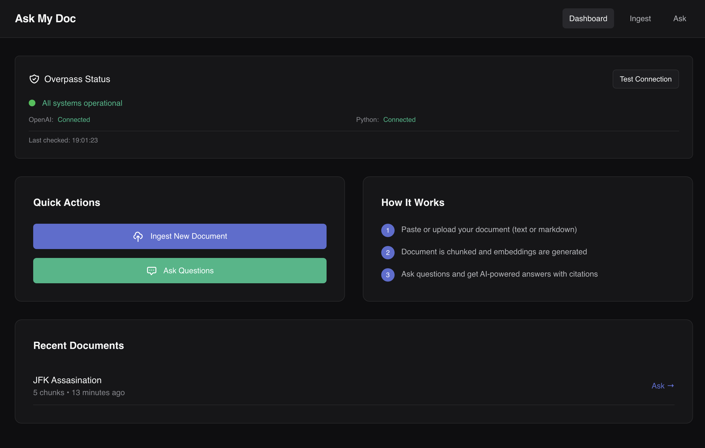

# Ask My Doc - RAG-powered Document Q&A System

A sophisticated document question-answering application built with Laravel, Livewire, and AI. Features a Linear-inspired dark theme UI for an elegant, modern experience.



## 🌟 Features

- **Document Ingestion**: Upload or paste documents (txt/md) for processing
- **Smart Chunking**: Automatic text chunking with configurable overlap
- **Vector Embeddings**: OpenAI-powered embeddings for semantic search
- **RAG Q&A**: Ask questions and get AI-powered answers with source citations
- **Linear-Inspired UI**: Beautiful dark theme with refined typography and spacing
- **Real-time Status**: Monitor AI service connections and health

## 🛠 Tech Stacks

- **Backend**: Laravel 12, PHP 8.4
- **Frontend**: Livewire 3, Tailwind CSS 4
- **Database**: SQLite with vector storage
- **AI Bridge**: Custom Overpass service (inspired by [bmadigan/overpass](https://github.com/bmadigan/overpass))
- **Embeddings**: OpenAI text-embedding-3-small
- **Chat**: OpenAI GPT-4o-mini
- **Python**: Vector similarity search with NumPy

## 📋 Prerequisites

- PHP 8.2+
- Composer
- Node.js & NPM
- Python 3.10+
- OpenAI API key

## 🚀 Installation

### 1. Clone and Install Dependencies

```bash
# Clone the repository
git clone <your-repo-url>
cd overpass-test

# Install PHP dependencies
composer install

# Install Node dependencies
npm install

# Install Python dependencies
pip3 install -r overpass-ai/requirements.txt
```

### 2. Environment Setup

```bash
# Copy environment file
cp .env.example .env

# Generate application key
php artisan key:generate
```

### 3. Configure OpenAI

Edit `.env` and add your OpenAI API key:

```env
OPENAI_API_KEY=your-actual-api-key-here
```

### 4. Database Setup

```bash
# Run migrations
php artisan migrate
```

### 5. Build Assets

```bash
# Build frontend assets
npm run build

# Or run in development mode
npm run dev
```

## 🎯 Usage

### Start the Application

```bash
# Start Laravel server
php artisan serve

# Or use the dev script (includes Vite, queue, and logs)
composer run dev
```

Visit http://localhost:8000

### How It Works

1. **Ingest Documents**
   - Navigate to "Ingest" page
   - Paste text or upload .txt/.md files
   - Configure chunk size (default: 1000 chars) and overlap (default: 200 chars)
   - Click "Chunk & Embed" to process

2. **Ask Questions**
   - Go to "Ask" page
   - Select your document
   - Type your question
   - Adjust settings:
     - Top K Results: Number of relevant chunks to retrieve (1-10)
     - Min Similarity Score: Minimum relevance threshold (0.0-1.0)
   - Get AI-powered answers with source citations

3. **Monitor Status**
   - Dashboard shows Overpass connection status
   - Real-time health checks for OpenAI and Python bridge
   - View recent documents and quick actions

## 🏗 Architecture

### Overpass Service
Custom implementation inspired by [bmadigan/overpass](https://github.com/bmadigan/overpass) providing:
- OpenAI integration for embeddings and chat
- Python bridge for vector operations
- SQLite vector search with cosine similarity

### Database Schema
- `documents`: Stores document metadata
- `chunks`: Stores text chunks with embeddings (JSON)
- `queries`: Logs Q&A interactions for analytics

### Python Bridge
Located in `overpass-ai/main.py`:
- `health_check`: Service status verification
- `sqlite_search`: Vector similarity search with scoring
- `vector_search`: Generic vector operations

## 🎨 UI Design

The application features a Linear-inspired dark theme with:
- **Color Palette**: Neutral grays with subtle accent colors
- **Typography**: Inter font with refined spacing
- **Components**: Generous padding, subtle borders, smooth transitions
- **Accessibility**: High contrast for readability

## 🧪 Testing

```bash
# Run all tests
php artisan test

# Run specific test file
php artisan test tests/Feature/ExampleTest.php

# Run with filter
php artisan test --filter=testName
```

## 🔧 Configuration

### Chunking Settings
Adjust in the UI or configure defaults:
- Chunk Size: 500-2000 characters
- Overlap Size: 0-500 characters

### AI Models
Configure in `.env`:
```env
OVERPASS_EMBEDDING_MODEL=text-embedding-3-small
OVERPASS_CHAT_MODEL=gpt-4o-mini
```

### Python Script Path
```env
OVERPASS_SCRIPT_PATH=/path/to/overpass-ai/main.py
```

## 📝 Environment Variables

```env
# Application
APP_NAME="Ask My Doc"
APP_ENV=local
APP_DEBUG=true
APP_URL=http://localhost:8000

# Database
DB_CONNECTION=sqlite

# OpenAI Configuration
OPENAI_API_KEY=your-openai-api-key

# Overpass Configuration
OVERPASS_SCRIPT_PATH="${PWD}/overpass-ai/main.py"
OVERPASS_TIMEOUT=60
OVERPASS_MAX_OUTPUT=1048576
OVERPASS_EMBEDDING_MODEL=text-embedding-3-small
OVERPASS_CHAT_MODEL=gpt-4o-mini
```

## 🤝 Contributing

Contributions are welcome! Please feel free to submit a Pull Request.

## 📄 License

This project is open source and available under the [MIT License](LICENSE).

## 🙏 Credits

- UI design inspired by [Linear](https://linear.app)
- Original Overpass concept by [bmadigan/overpass](https://github.com/bmadigan/overpass)
- Built with [Laravel](https://laravel.com) and [Livewire](https://livewire.laravel.com)

## 🐛 Troubleshooting

### Python Bridge Error
If you see "Python: error" in the status card:
1. Ensure Python 3.10+ is installed
2. Check Python dependencies: `pip3 list | grep -E "openai|numpy"`
3. Verify script path in `.env`
4. Test directly: `python3 overpass-ai/main.py '{"operation":"health_check","payload":{}}'`

### OpenAI Connection Issues
1. Verify API key is set correctly in `.env`
2. Check API key validity at https://platform.openai.com
3. Ensure you have sufficient credits

### Database Issues
1. Ensure SQLite is installed
2. Check database file exists: `database/database.sqlite`
3. Re-run migrations if needed: `php artisan migrate:fresh`

## 📚 Documentation

For more information about the technologies used:
- [Laravel Documentation](https://laravel.com/docs)
- [Livewire Documentation](https://livewire.laravel.com/docs)
- [OpenAI API Documentation](https://platform.openai.com/docs)
- [Overpass Inspiration](https://github.com/bmadigan/overpass)
